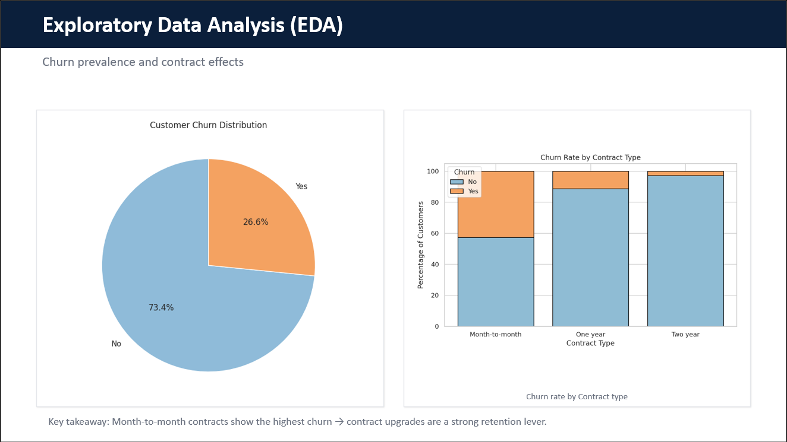
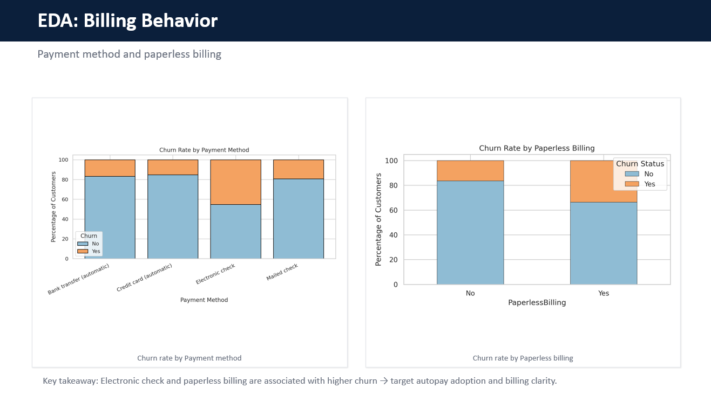
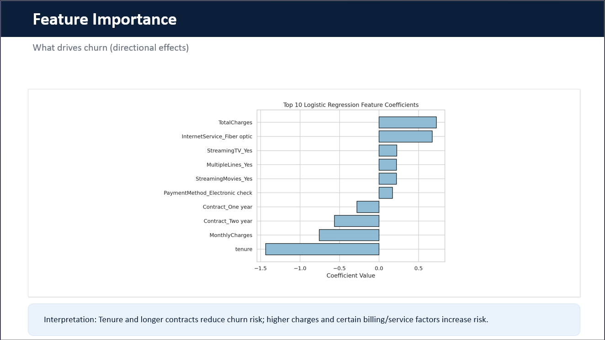

# Customer Churn Prediction & Retention Strategy

## Overview
Customer churn is a major challenge in telecom due to high competition and low switching costs. 

This project builds a predictive model to identify high-risk customers and provides actionable insights to improve retention strategies and reduce revenue loss.

## Tools
Python (Pandas, NumPy, Scikit-learn), Matplotlib, Seaborn

## Key Steps
- Data cleaning and preprocessing
- Exploratory data analysis (EDA)
- Logistic regression model (ROC-AUC: 0.838)
- Customer segmentation (K-means)

## Key Insights
- Month-to-month contracts have the highest churn
- Low-tenure customers are most at risk
- Electronic check and paperless billing are linked to higher churn
- Security and support services reduce churn

## Business Impact
This project enables companies to:
- Identify high-risk customers early using churn probability scores
- Target retention efforts (discounts, contract upgrades, service bundling)
- Allocate resources efficiently instead of treating all customers equally

## Key Visuals

### Churn by Contract Type

### Billing & Payment Behavior

### Key Drivers of Churn (Model Interpretation)

